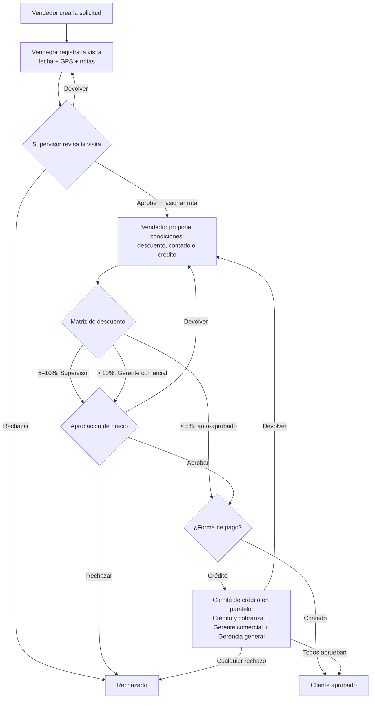

# Aprobación de Clientes — Distribuidora de Lubricantes

App web para gestionar el alta y aprobación de clientes nuevos: desde la solicitud del vendedor y
la visita al lugar, pasando por la asignación de ruta, hasta la aprobación del precio de
venta/descuento y las condiciones de crédito. El diseño sigue el patrón de flujos de aprobación de
SAP Ariba / SAP SD: **auto-aprobación bajo umbral, escalamiento por niveles por encima, y
aprobación en paralelo (comité) para el crédito**, con historial auditable de cada decisión.

## Flujo de aprobación



## Roles y responsabilidades

| Rol | Responsabilidad en el flujo |
| --- | --- |
| Vendedor / Asesor de ruta | Crea la solicitud, registra la visita con geolocalización y propone las condiciones comerciales. |
| Supervisor de ventas | Valida la visita con la evidencia, asigna la ruta y aprueba descuentos de 5–10%. |
| Gerente comercial | Aprueba descuentos mayores al 10% y vota en el comité de crédito. |
| Crédito y cobranza | Vota en el comité de crédito (límite y plazo). |
| Gerencia general | Vota en el comité de crédito. |

La matriz de descuentos, los miembros del comité, las rutas, los tipos de negocio y los plazos se
configuran en [`src/config.ts`](src/config.ts). La lógica del flujo (transiciones, quién aprueba
qué) vive en [`src/workflow.ts`](src/workflow.ts) como funciones puras, separada de la interfaz.

## Reglas del flujo

- **Matriz de descuento por niveles**: hasta 5% auto-aprobado; 5–10% aprueba el supervisor; más de
  10% aprueba el gerente comercial.
- **Comité de crédito en paralelo**: los tres miembros deben aprobar; un solo rechazo cierra la
  solicitud; cualquiera puede devolverla al vendedor para ajustar condiciones.
- **Venta de contado** no pasa por el comité: queda aprobada al aprobarse el precio.
- **Devoluciones**: en cada punto de aprobación se puede devolver la solicitud a la etapa anterior
  con comentario obligatorio, sin rechazarla definitivamente.
- **Auditoría**: cada acción (quién, cuándo, qué decidió y con qué comentario) queda en el
  historial de la solicitud.

## Correr localmente

```bash
npm install
npm run dev
```

Abre `http://localhost:5173/ruteo/`. Los datos se guardan en `localStorage` del navegador (sin
backend, igual que la app Geodata). El selector «Actuando como» de la cabecera permite simular
cada rol para probar el flujo completo.

## Próximos pasos sugeridos

- Backend con usuarios reales y notificaciones (correo/WhatsApp) a cada aprobador pendiente.
- Captura de fotos como evidencia de la visita.
- Integración con la app [Geodata](https://github.com/mrenedelacruz-bit/geodata) para evaluar el
  potencial de la zona del cliente (demanda/competencia) como dato de apoyo para el supervisor.
- Reglas adicionales de la matriz: escalar también por monto estimado de compra mensual, no solo
  por % de descuento.
